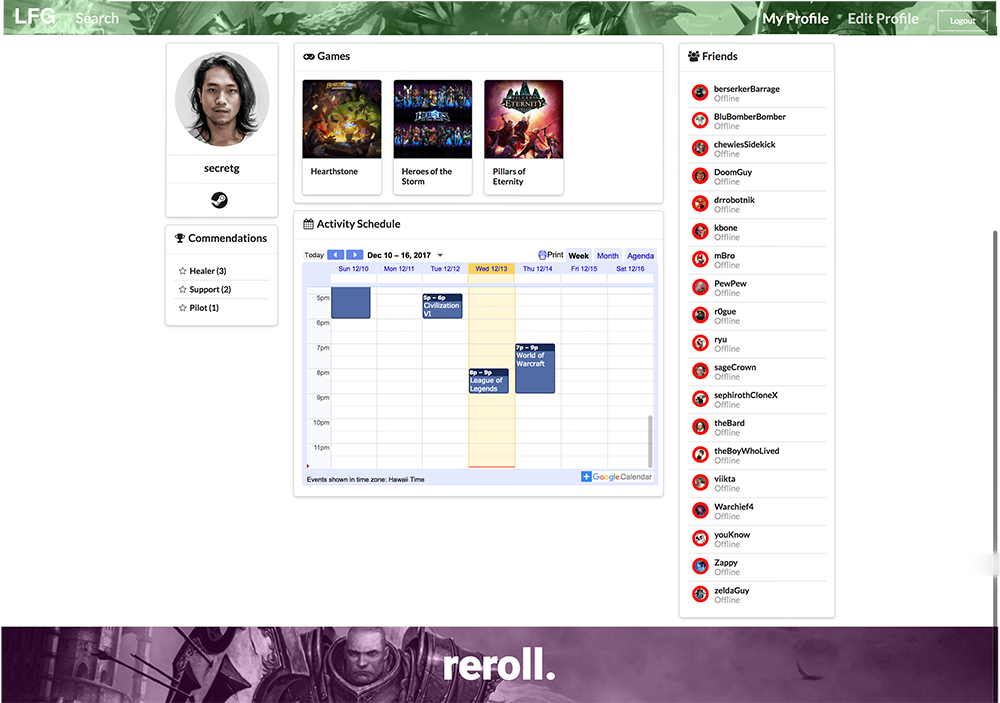
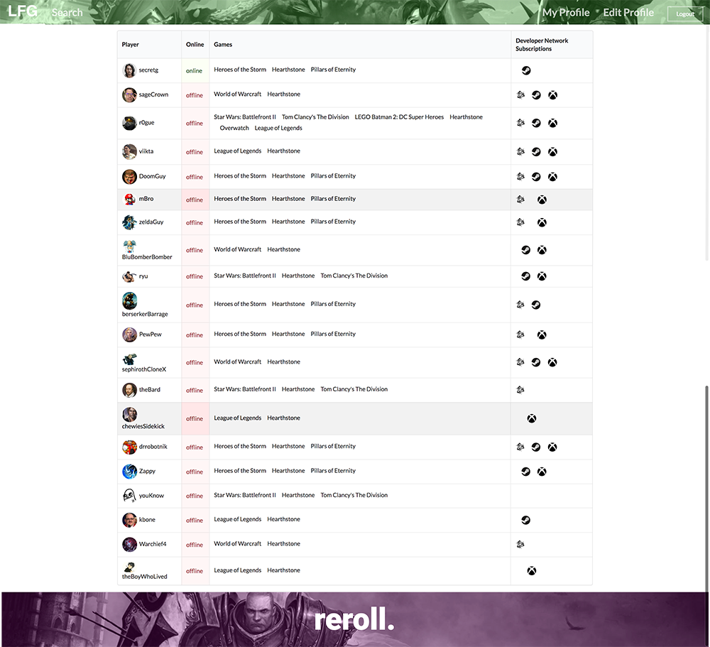

## Looking for Game

Link: <a href="https://lookingforgame.meteorapp.com">Link Here</a>

Link: <a href="https://looking-for-game.github.io">Our Project page with lastest updates</a>

Looking for game is project that I worked in collaboration with Blake Wallick, Tallas Goo, and Victor Pawid. We had a vision for a web application that would be able to connect people locally to allow people to create game groups on our University's Campus. We are all college students and are keenly aware of the some of the trials and tribulations of going to school, we understand that if the you're to succeed as a student it helps if you have a core group of friends to help you along the way. Our intended goal for this platform is to help foster those relationships, we know how hard it can be to meet new people and saw that video games could help be a common ground to help people relate to one another. We are really excited how our project is turning out though we still have a long way to go before our vision can be satisfied. 

Some of the things that I worked on for this project was the landing page(Above, Super Slick Parallax Scrolling!), helped with creating the code to add and modify users, created the logic for the site to determine if this is the users first time to the site and aided with the logic to deternmine if a user is online or offline. I was also responsible for the graphics for the site and the overall look and feel. 

This experience for me was very valuable, I learned so much working these gentlemen. This was my first time working on a project of this scale with multiple people, prior to this I was always working on stuff by myself. I thought our team worked very well together and everyone very open to discussions and suggestions we should make along the way. Also through this experience I learned how Github can be such an incredible tool when trying to do group projects, how to push and pull things and revert changes. I can't imagine what it must have been like trying to develop software with other people without a tool like Github. Finally I am walking away from this experience with so much more appreciation for software engineering in gerneral.

Below are some screen shots of our web application Looking for Game:

Public Profile page

Search Page

Home page

