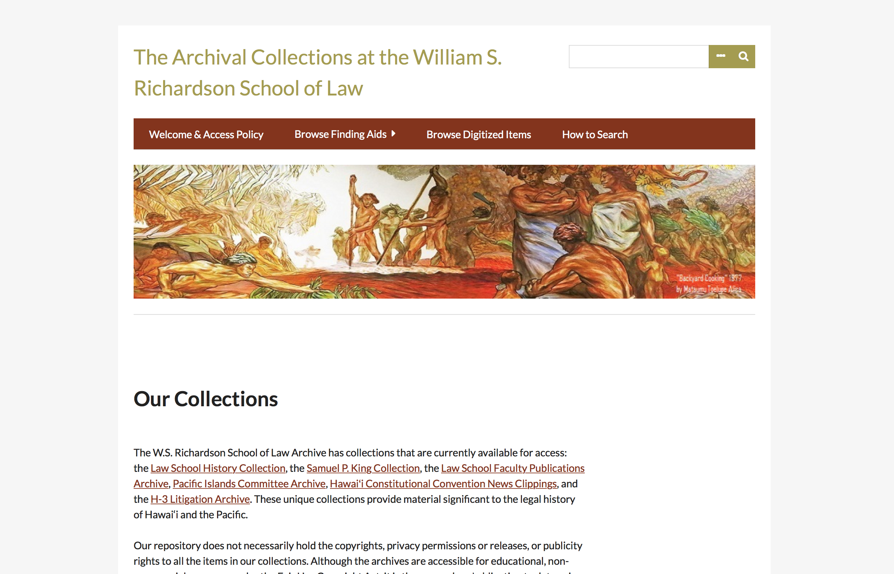

This site is for the William S. Richardson School of Law. The school plans to use this site to catalog articles. The site isn't live yet as there is more work that needs to be finished. The role I had in this site was the initial set up of the server, installation of the web server, installation of the back end(Omeka), and support with additional plugins.
